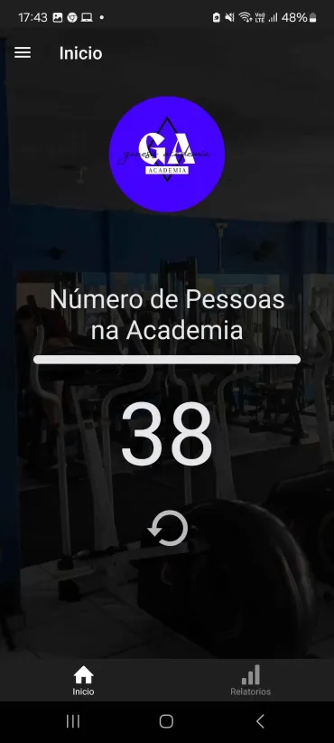
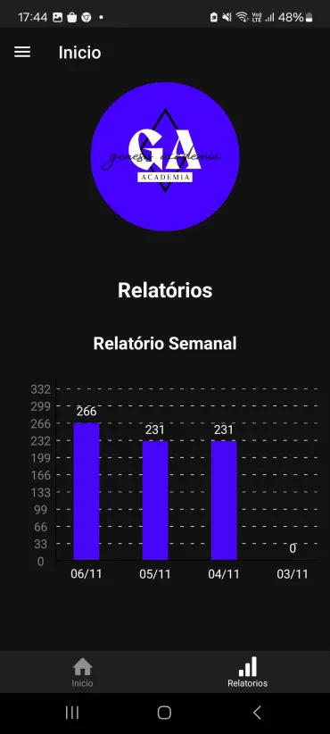
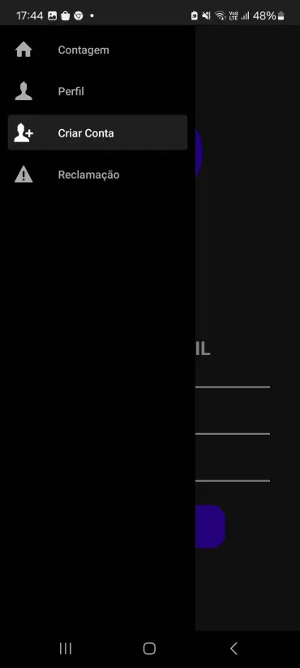

⚠️Projeto em desenvolvimento⚠️

📊 RTU - REAL TIME USER
RTU é um aplicativo de gerenciamento de fluxo de pessoas em ambientes, desenvolvido em parceria com a Academia Genesis.
O sistema opera com apenas uma catraca, monitorando entradas/saídas e gerando relatórios em tempo real.
✨ Funcionalidades
🏠 Tela Inicial

    Contagem ao vivo de pessoas no ambiente.

    Visualização imediata da lotação.

📈 Relatórios Automáticos

    Gera dados de frequência por semana, dia ou mês.

    Exportável para análise de desempenho.

📊 Gráficos de Movimentação

    Visualização intuitiva de picos de movimento.

    Comparativo entre períodos.

🧭 Navegação Intuitiva

    Acesso rápido a:

        Criação de perfis.

        Aba de reclamações.

        Controle de catraca.
 📥 link de download
        https://drive.google.com/file/d/1VYMQn5AXEz0hopGfyQhs-eNuh2P4WOax/view?usp=sharing

 
